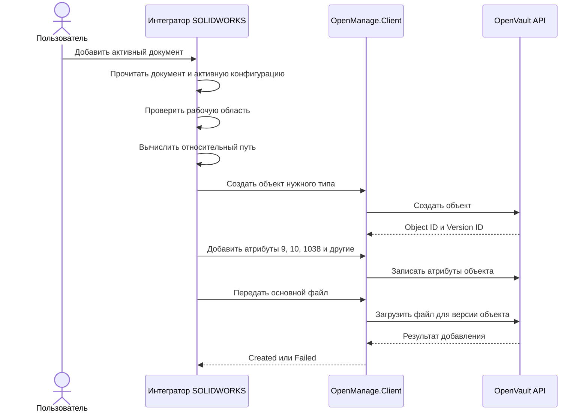
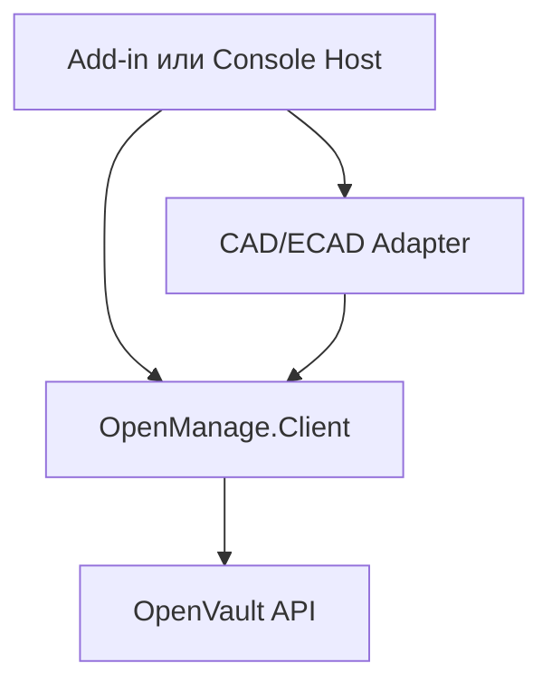

# Архитектурные требования OpenVault

Этот документ является единым источником архитектурных требований для:

- интеграторов SOLIDWORKS, Autodesk Inventor, Altium Designer и EPLAN;
- библиотеки `OpenVault.Client`;
- серверного проекта OpenVault API.

Документ предназначен для совместного чтения людьми и ИИ. Требования имеют стабильные идентификаторы, а утверждённые решения отделены от открытых вопросов.

## 1. Нормативные обозначения

Ключевые слова используются в следующем смысле:

- **ДОЛЖЕН** — обязательное требование;
- **НЕ ДОЛЖЕН** — запрещённое поведение;
- **СЛЕДУЕТ** — рекомендуемое поведение;
- **МОЖЕТ** — допустимый вариант реализации.

## 2. Термины

| Термин | Определение |
|---|---|
| Рабочая область | Корневая папка на компьютере пользователя, внутри которой должны находиться все файлы, доступные для операций OpenVault. |
| Полный путь | Абсолютный путь Windows, например `D:\Vault\Project\ABCD\Part1.sldprt`. |
| Относительный путь | Путь относительно рабочей области, например `Project\ABCD\Part1.sldprt`. Хранится в атрибуте объекта `1038`. |
| Основной файл | Файл документа, прикреплённый через атрибут `1002` и имеющий `F_LINKTYPE = 4`. |
| Интегратор SOLIDWORKS | Клиентский компонент, который получает данные через SOLIDWORKS API, сопоставляет свойства и вызывает `OpenVault.Client`. |
| Версия объекта | Конкретное изменяемое состояние логического объекта, имеющее собственный ID. |

## 3. Утверждённые архитектурные решения

### ADR-001. Рабочая область

Путь к рабочей области задаётся в настройках клиентского приложения.

До реализации механизма настроек используется значение:

```text
D:\Vault\
```

Все файлы, с которыми работает интеграция, ДОЛЖНЫ находиться внутри рабочей области.

### ADR-002. Идентичность файла

На текущем этапе сервер идентифицирует файл по `F_FILENAME`.

- `F_FILENAME` содержит имя файла с расширением, например `Part1.sldprt`.
- Имя файла ДОЛЖНО быть уникальным во всей базе данных.
- Уникальность ДОЛЖНА контролироваться сервером без учёта регистра.
- `Part1.sldprt` и `PART1.SLDPRT` считаются одним именем.
- Клиентская проверка не заменяет серверное ограничение уникальности.

Следствие: на текущем этапе система не допускает два файла с одинаковым именем даже при их расположении в разных каталогах рабочей области.

### ADR-003. Относительный путь

Относительный путь хранится как значение атрибута объекта:

```text
AttributeId = 1038
```

Атрибут `1038` ДОЛЖЕН создаваться и обновляться вместе с другими атрибутами документа, включая:

| AttributeId | Назначение |
|---:|---|
| `9` | Обозначение |
| `10` | Наименование |
| `1038` | Относительный путь к файлу внутри рабочей области |

Дополнительные сопоставления свойств SOLIDWORKS с атрибутами OpenVault задаются интегратором.

### ADR-004. Связь файла с версией объекта

`OM_STORAGE.F_OBJECTLINK_ID` содержит ID конкретной версии объекта, а не логический ID объекта.

Это решение необходимо для сохранения истории изменений документа и однозначной связи файла с соответствующей версией объекта.

Запрос:

```http
GET /api/Objects/{id}
```

ДОЛЖЕН принимать ID конкретной версии объекта, возвращённый в `F_OBJECTLINK_ID`.

### ADR-005. Разделение файловых атрибутов

Поля `F_ATTRIBUTE_ID` и `F_LINKTYPE` имеют разные назначения:

- `F_ATTRIBUTE_ID` указывает атрибут объекта, через который прикреплён файл;
- `F_LINKTYPE` определяет тип представления файла.

Для основного файла текущего документа используется комбинация:

```text
F_ATTRIBUTE_ID = 1002
F_LINKTYPE      = 4
```

Работа с preview и PDF-представлениями не входит в первый этап.

### ADR-010. Управление файлами выполняет OpenVault API

Поиск, проверка уникальности, добавление, удаление и обновление файлов являются серверными операциями OpenVault API.

В `OpenManage.Client` НЕ ДОЛЖНЫ появляться:

- локальное файловое хранилище;
- репозиторий, работающий с `OM_STORAGE` напрямую;
- самостоятельная логика уникальности, поиска или выбора между созданием и обновлением;
- компонент `OpenManage.Client.Storage`, реализующий серверные правила управления файлами.

Wrapper МОЖЕТ содержать только типизированный вызов утверждённого API-метода загрузки файла. Название фасада и DTO определяются фактическим контрактом OpenVault API.

До реализации серверного поиска действует временный режим `CreateOnly`:

1. интегратор считает, что файла в базе ещё нет;
2. создаёт объект требуемого типа;
3. добавляет атрибуты объекта;
4. передаёт основной файл OpenVault API;
5. не выполняет поиск, обновление или удаление файла.

Повторный запуск для того же файла в режиме `CreateOnly` не является идемпотентным. Сервер может создать дубликат или вернуть конфликт. Этот режим предназначен только для первоначальной разработки и контролируемых тестов.

### ADR-011. Единый тип идентификатора физической версии

`OM_OBJECTS.F_OBJECT_ID` и публичный `ObjectResponse.ObjectId` используют `long`, но текущий `/api/Storage` принимает `ObjectLinkId` как `int`.

Это несоответствие создаёт риск переполнения, ошибочной привязки файла и расхождения контрактов API и wrapper.

Все представления идентификатора физической версии ДОЛЖНЫ быть приведены к `long`:

- `WriteStorageRequest.ObjectLinkId`;
- `StorageResponse.ObjectLinkId` и `StorageFileResponse.ObjectLinkId`;
- параметры маршрутов `by-object/{objectLinkId}`;
- интерфейсы `IStorageService` и `IStorageRepository`;
- `StorageService`, `StorageRepository`, `StorageReader` и `StorageWriter`;
- `DBStorage.Objectlinkid` и конфигурация `F_OBJECTLINK_ID`;
- DTO и методы `OpenManage.Client`.

`FileId`, `AttributeId` и `LinkType` остаются `int`, поскольку относятся к другим идентификаторам и справочным значениям.

## 4. Сценарий: добавить активный документ SOLIDWORKS

### 4.1. Предусловия

- SOLIDWORKS запущен.
- В SOLIDWORKS открыт активный документ.
- Документ сохранён на диске.
- Документ находится внутри рабочей области.
- На первом этапе обрабатывается только активная конфигурация.

### 4.2. Последовательность текущего этапа CreateOnly



Поиск файла до добавления на этом этапе НЕ выполняется.

### 4.3. Получение и проверка пути

#### SW-REQ-001

Интегратор ДОЛЖЕН получить полный путь активного документа через SOLIDWORKS API вместе с расширением файла.

#### SW-REQ-002

Если документ не сохранён и путь пустой, интегратор ДОЛЖЕН прекратить операцию и вернуть понятную ошибку.

#### SW-REQ-003

Интегратор ДОЛЖЕН проверить, что полный путь находится внутри рабочей области с учётом границы каталога.

Например, путь `D:\VaultBackup\Part1.sldprt` НЕ ДОЛЖЕН считаться находящимся внутри `D:\Vault\`.

#### SW-REQ-004

Интегратор ДОЛЖЕН вычислить относительный путь от корня рабочей области.

Пример:

```text
Рабочая область: D:\Vault\
Полный путь:     D:\Vault\Project\ABCD\Part1.sldprt
Имя файла:       Part1.sldprt
Относительный:   Project\ABCD\Part1.sldprt
```

#### SW-REQ-005

Интегратор НЕ ДОЛЖЕН передавать полный локальный путь серверу.

### 4.4. Поиск и синхронизация отложены

Предварительный маршрут `GET /api/storage/info?fileName=Part1.sldprt` ещё не реализован и НЕ входит в текущую итерацию wrapper.

После реализации серверного API необходимо отдельно утвердить контракт поиска, DTO метаданных без `F_FILEBODY`, получение связанной версии по `F_OBJECTLINK_ID` и выбор серверной операции: создать, обновить или вернуть конфликт.

До этого wrapper НЕ ДОЛЖЕН эмулировать поиск по локальным данным или обращаться к базе напрямую.

### 4.5. Добавление атрибутов и файла

#### SYNC-REQ-001

Интегратор ДОЛЖЕН прочитать свойства активной конфигурации SOLIDWORKS и сопоставить их с ID атрибутов OpenVault.

#### SYNC-REQ-002

При создании объекта передаются атрибуты `9`, `10`, `1038` и дополнительные атрибуты, заданные конфигурацией интегратора.

#### FILE-REQ-001

Основной файл передаётся серверному API для конкретного Version Object ID с `F_ATTRIBUTE_ID = 1002` и `F_LINKTYPE = 4`.

#### FILE-REQ-002

Wrapper только формирует и отправляет типизированный запрос. Создание записи `OM_STORAGE`, сохранение `F_FILEBODY` и проверка ограничений выполняются сервером.

#### FILE-REQ-003

Для первого этапа используется существующий `POST /api/Storage` с JSON-моделью `WriteStorageRequest`. Wrapper предоставляет только типизированный метод добавления файла, например `client.Files.AddAsync(...)`.

## 5. Представление файла в OM_STORAGE

| Поле | Назначение |
|---|---|
| `F_FILE_ID` | Автоинкрементный идентификатор записи файла. |
| `F_FILENAME` | Регистронезависимо уникальное имя файла в базе данных. |
| `F_FILEBODY` | Содержимое файла в виде массива байтов. |
| `F_FILESIZE` | Размер файла на диске. |
| `F_FILEDATE` | Дата добавления файла в OpenVault. |
| `F_OBJECTLINK_ID` | ID конкретной версии объекта, к которой прикреплён файл. |
| `F_ATTRIBUTE_ID` | ID файлового атрибута объекта; `1002` — основной файл. |
| `F_LINKTYPE` | Тип представления файла; `4` — основной файл, `2` — preview. |

## 6. Распределение ответственности

| Компонент | Ответственность |
|---|---|
| Интегратор SOLIDWORKS | Активный документ, рабочая область, относительный путь, активная конфигурация, свойства и их сопоставление. |
| `OpenManage.Client` | Нейтральные DTO и типизированная передача запросов OpenVault API. Не управляет `OM_STORAGE` и не реализует серверные правила файлов. |
| OpenVault API | Поиск, уникальность, добавление, удаление и обновление файлов; работа с `OM_STORAGE`; управление объектами и версиями. |
| База данных | Хранение файлов и связей с версиями объектов; обеспечение ограничений и защита от гонок. |

## 7. Декомпозиция задач

### Текущая итерация CreateOnly

| ID | Проект | Задача |
|---|---|---|
| `SW-01` | SOLIDWORKS Adapter | Получить активный документ, путь, тип и конфигурацию. |
| `SW-02` | SOLIDWORKS Adapter | Прочитать свойства и вернуть нейтральную модель. |
| `INT-01` | OpenManage.Client | Проверить `D:\Vault\` и вычислить относительный путь. |
| `MAP-01` | OpenManage.Client | Преобразовать свойства и добавить атрибут `1038`. |
| `API-TYPE-01` | OpenVault API | Привести `ObjectLinkId` и `F_OBJECTLINK_ID` к `long` во всех слоях Storage и добавить contract-тесты граничных значений. |
| `CLIENT-ADD-01` | OpenManage.Client | После `API-TYPE-01` добавить `client.Files.AddAsync(...)` для `POST /api/Storage`, используя `long ObjectLinkId`. |
| `HOST-01` | ConsoleStub | Выполнить CreateOnly-сценарий и вывести результат. |

### Отложено до реализации серверного API

| ID | Проект | Задача |
|---|---|---|
| `API-FIND-01` | OpenVault API | Поиск файла по имени без `F_FILEBODY`. |
| `API-FILE-02` | OpenVault API | Обновление и удаление файлов. |
| `API-UNIQUE-01` | OpenVault API/DB | Регистронезависимая уникальность `F_FILENAME`. |
| `CLIENT-FIND-01` | OpenManage.Client | Типизированный вызов поиска после утверждения API. |
| `SYNC-01` | Integration | Ветви Found/Create/Update после появления серверных операций. |

## 8. Открытые вопросы

### OQ-001. Изменение содержимого существующего файла

Требуется определить поведение, если файл с таким именем найден, но локальное содержимое изменилось:

- обновить файл существующей версии;
- создать новую версию объекта и связать файл с ней;
- вернуть конфликт и потребовать отдельную пользовательскую команду.

Решение должно учитывать механизм версионности IPS и OpenVault.

### OQ-002. Переименование файла

После переименования поиск по новому `F_FILENAME` не сможет определить предыдущую версию документа только по имени. Сценарий переименования необходимо спроектировать отдельно.

## 9. Архитектура интеграций CAD/ECAD

### ADR-006. Общая схема интеграции

Каждая CAD/ECAD-система ДОЛЖНА иметь отдельный набор библиотек. Общие сценарии интеграции, нейтральные модели, механизм mapping и HTTP-клиент размещаются в `OpenManage.Client`.



Типы API конкретной инженерной системы, включая COM и Interop, НЕ ДОЛЖНЫ выходить за границу её Adapter-проекта.

### ADR-007. Структура solution

```text
CADShark.OpenManage.Client.sln
├── CADShark.OpenManage.Client.csproj
│   ├── Http
│   ├── Objects
│   ├── Relations
│   ├── Search
│   ├── Integration
│   │   ├── IEngineeringDocumentSource
│   │   └── Models
│   └── Mapping
├── integrations
│   ├── SolidWorks
│   │   ├── OpenManage.SolidWorks.Adapter
│   │   └── OpenManage.SolidWorks.AddIn          (позже)
│   ├── Inventor                                 (позже)
│   ├── Altium                                   (позже)
│   └── Eplan                                    (позже)
└── samples
    └── OpenManage.SolidWorks.ConsoleStub
```

| Компонент | Target Framework | Ответственность |
|---|---|---|
| `OpenManage.Client` | `netstandard2.0` | OpenVault API, DTO, общие сценарии Integration, нейтральные инженерные модели и общий механизм Mapping. |
| `OpenManage.SolidWorks.Adapter` | `net48` | SOLIDWORKS API/Interop, активный документ, активная конфигурация и преобразование в нейтральную модель. |
| `OpenManage.SolidWorks.ConsoleStub` | `net48` | Временный host для запуска и проверки сценариев без Add-in UI. |
| `OpenManage.SolidWorks.AddIn` | `net48` | Будущие команды, UI, регистрация и жизненный цикл Add-in. |
| Adapter/Host других CAD/ECAD | определяется SDK системы | Изолированная работа с Autodesk Inventor, Altium Designer или EPLAN по тем же границам. |

### ADR-008. Нейтральный контракт документа

Adapter ДОЛЖЕН возвращать `EngineeringDocumentInfo` через `IEngineeringDocumentSource`.

Нейтральная модель содержит:

- полный локальный путь;
- тип инженерного документа;
- имя активной конфигурации, когда система поддерживает конфигурации;
- словарь свойств без типов CAD/ECAD SDK.

`OpenManage.Client` НЕ ДОЛЖЕН:

- подключать SOLIDWORKS, Inventor, Altium или EPLAN SDK;
- запускать или управлять CAD/ECAD-приложением;
- знать особенности активного документа конкретной системы;
- содержать названия конкретных свойств как жёстко заданные правила.

### ADR-009. Mapping

Общий механизм преобразования `PropertyName → AttributeId` находится в `OpenManage.Client.Mapping`.

Конкретный набор правил принадлежит интеграции или её конфигурации. Пример для SOLIDWORKS:

```text
Обозначение  → AttributeId 9
Наименование → AttributeId 10
```

Атрибут относительного пути `1038` добавляется общим сценарием Integration после проверки рабочей области и не зависит от названия свойства CAD/ECAD.

### Правила зависимостей

1. Host/Add-in МОЖЕТ зависеть от своего Adapter и `OpenManage.Client`.
2. Adapter МОЖЕТ зависеть от SDK своей CAD/ECAD-системы и `OpenManage.Client`.
3. `OpenManage.Client` НЕ ДОЛЖЕН зависеть от Adapter, Host, Add-in или CAD/ECAD SDK.
4. Adapter одной инженерной системы НЕ ДОЛЖЕН зависеть от Adapter другой системы.
5. OpenVault API принимает только нейтральные DTO и ничего не знает о CAD/ECAD SDK.
6. Консольная заглушка НЕ ДОЛЖНА становиться постоянным местом хранения SOLIDWORKS Interop-логики.

## 10. Источники

- Требования проекта OpenVault, согласованные в рабочем обсуждении.
- *IPS. Руководство программиста*, раздел 4.4.10 «Файлы и двоичные данные (ftFile, ftBlob, ftShortBlob)».
- *IPS. Руководство администратора*: файловые атрибуты, файловые хранилища и контроль уникальности.
- *IPS. Руководство пользователя*: импорт и работа с файлами документов.

## 11. История изменений

| Версия | Дата | Изменения |
|---|---|---|
| `0.1` | 2026-08-13 | Зафиксированы рабочая область, первоначальный процесс поиска файла и структура `OM_STORAGE`. |
| `0.2` | 2026-08-13 | Markdown принят как основной формат; атрибут `1038` назначен относительному пути; `F_OBJECTLINK_ID` определён как ID версии; подтверждена регистронезависимая серверная уникальность имени. |
| `0.3` | 2026-08-13 | Утверждена расширяемая архитектура CAD/ECAD-интеграций, структура solution, нейтральный контракт документа, границы Adapter/Host и размещение Mapping. |
| `0.4` | 2026-08-13 | Управление файлами закреплено за OpenVault API; бизнес-логика Storage исключена из wrapper; текущий этап переведён в режим CreateOnly. |
| `0.5` | 2026-08-13 | Подтверждён `POST /api/Storage` для добавления основного файла; PDF, preview, версии и остальные файловые операции исключены из первого этапа; добавлено требование унифицировать `ObjectLinkId` и `F_OBJECTLINK_ID` как `long`. |
