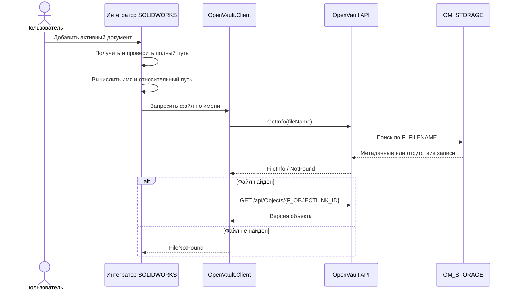
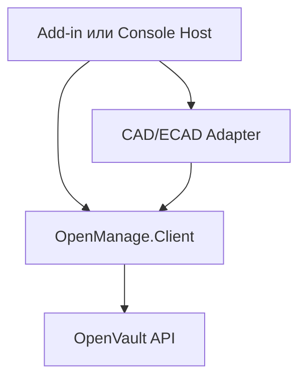

# Архитектурные требования OpenVault

Этот документ является единым источником архитектурных требований для:

- интеграторов SOLIDWORKS, Autodesk Inventor, Altium Designer и EPLAN;
- библиотеки `OpenVault.Client`;
- серверного проекта OpenVault API.

Документ предназначен для совместного чтения людьми и ИИ. Требования имеют стабильные идентификаторы, а утверждённые решения отделены от открытых вопросов.

## 1. Нормативные обозначения

Ключевые слова используются в следующем смысле:

- **ДОЛЖЕН** — обязательное требование;
- **НЕ ДОЛЖЕН** — запрещённое поведение;
- **СЛЕДУЕТ** — рекомендуемое поведение;
- **МОЖЕТ** — допустимый вариант реализации.

## 2. Термины

| Термин | Определение |
|---|---|
| Рабочая область | Корневая папка на компьютере пользователя, внутри которой должны находиться все файлы, доступные для операций OpenVault. |
| Полный путь | Абсолютный путь Windows, например `D:\Vault\Project\ABCD\Part1.sldprt`. |
| Относительный путь | Путь относительно рабочей области, например `Project\ABCD\Part1.sldprt`. Хранится в атрибуте объекта `1038`. |
| Основной файл | Файл документа, прикреплённый через атрибут `1002` и имеющий `F_LINKTYPE = 4`. |
| Интегратор SOLIDWORKS | Клиентский компонент, который получает данные через SOLIDWORKS API, сопоставляет свойства и вызывает `OpenVault.Client`. |
| Версия объекта | Конкретное изменяемое состояние логического объекта, имеющее собственный ID. |

## 3. Утверждённые архитектурные решения

### ADR-001. Рабочая область

Путь к рабочей области задаётся в настройках клиентского приложения.

До реализации механизма настроек используется значение:

```text
D:\Vault\
```

Все файлы, с которыми работает интеграция, ДОЛЖНЫ находиться внутри рабочей области.

### ADR-002. Идентичность файла

На текущем этапе сервер идентифицирует файл по `F_FILENAME`.

- `F_FILENAME` содержит имя файла с расширением, например `Part1.sldprt`.
- Имя файла ДОЛЖНО быть уникальным во всей базе данных.
- Уникальность ДОЛЖНА контролироваться сервером без учёта регистра.
- `Part1.sldprt` и `PART1.SLDPRT` считаются одним именем.
- Клиентская проверка не заменяет серверное ограничение уникальности.

Следствие: на текущем этапе система не допускает два файла с одинаковым именем даже при их расположении в разных каталогах рабочей области.

### ADR-003. Относительный путь

Относительный путь хранится как значение атрибута объекта:

```text
AttributeId = 1038
```

Атрибут `1038` ДОЛЖЕН создаваться и обновляться вместе с другими атрибутами документа, включая:

| AttributeId | Назначение |
|---:|---|
| `9` | Обозначение |
| `10` | Наименование |
| `1038` | Относительный путь к файлу внутри рабочей области |

Дополнительные сопоставления свойств SOLIDWORKS с атрибутами OpenVault задаются интегратором.

### ADR-004. Связь файла с версией объекта

`OM_STORAGE.F_OBJECTLINK_ID` содержит ID конкретной версии объекта, а не логический ID объекта.

Это решение необходимо для сохранения истории изменений документа и однозначной связи файла с соответствующей версией объекта.

Запрос:

```http
GET /api/Objects/{id}
```

ДОЛЖЕН принимать ID конкретной версии объекта, возвращённый в `F_OBJECTLINK_ID`.

### ADR-005. Разделение файловых атрибутов

Поля `F_ATTRIBUTE_ID` и `F_LINKTYPE` имеют разные назначения:

- `F_ATTRIBUTE_ID` указывает атрибут объекта, через который прикреплён файл;
- `F_LINKTYPE` определяет тип представления файла.

Для основного файла текущего документа используется комбинация:

```text
F_ATTRIBUTE_ID = 1002
F_LINKTYPE      = 4
```

Для preview используется:

```text
F_LINKTYPE = 2
```

### ADR-010. Управление файлами выполняет OpenVault API

Поиск, проверка уникальности, добавление, удаление и обновление файлов являются серверными операциями OpenVault API.

В `OpenManage.Client` НЕ ДОЛЖНЫ появляться:

- локальное файловое хранилище;
- репозиторий, работающий с `OM_STORAGE` напрямую;
- самостоятельная логика уникальности, поиска или выбора между созданием и обновлением;
- компонент `OpenManage.Client.Storage`, реализующий серверные правила управления файлами.

Wrapper МОЖЕТ содержать только типизированный вызов утверждённого API-метода загрузки файла. Название фасада и DTO определяются фактическим контрактом OpenVault API.

До реализации серверного поиска действует временный режим `CreateOnly`:

1. интегратор считает, что файла в базе ещё нет;
2. создаёт объект требуемого типа;
3. добавляет атрибуты объекта;
4. передаёт основной файл OpenVault API;
5. не выполняет поиск, обновление или удаление файла.

Повторный запуск для того же файла в режиме `CreateOnly` не является идемпотентным. Сервер может создать дубликат или вернуть конфликт. Этот режим предназначен только для первоначальной разработки и контролируемых тестов.

## 4. Сценарий: добавить активный документ SOLIDWORKS

### 4.1. Предусловия

- SOLIDWORKS запущен.
- В SOLIDWORKS открыт активный документ.
- Документ сохранён на диске.
- Документ находится внутри рабочей области.
- На первом этапе обрабатывается только активная конфигурация.

### 4.2. Последовательность



### 4.3. Получение и проверка пути

#### SW-REQ-001

Интегратор ДОЛЖЕН получить полный путь активного документа через SOLIDWORKS API вместе с расширением файла.

#### SW-REQ-002

Если документ не сохранён и путь пустой, интегратор ДОЛЖЕН прекратить операцию и вернуть понятную ошибку.

#### SW-REQ-003

Интегратор ДОЛЖЕН проверить, что полный путь находится внутри рабочей области с учётом границы каталога.

Например, путь `D:\VaultBackup\Part1.sldprt` НЕ ДОЛЖЕН считаться находящимся внутри `D:\Vault\`.

#### SW-REQ-004

Интегратор ДОЛЖЕН вычислить относительный путь от корня рабочей области.

Пример:

```text
Рабочая область: D:\Vault\
Полный путь:     D:\Vault\Project\ABCD\Part1.sldprt
Имя файла:       Part1.sldprt
Относительный:   Project\ABCD\Part1.sldprt
```

#### SW-REQ-005

Интегратор НЕ ДОЛЖЕН передавать полный локальный путь серверу.

### 4.4. Поиск файла

#### API-REQ-001

До создания объекта и загрузки файла клиент ДОЛЖЕН запросить сведения о наличии файла по его имени.

Предварительный маршрут:

```http
GET /api/storage/info?fileName=Part1.sldprt
```

Название и форма маршрута считаются предварительными до утверждения контракта OpenVault API.

#### API-REQ-002

Сервер ДОЛЖЕН выполнять регистронезависимый поиск по `OM_STORAGE.F_FILENAME`.

#### API-REQ-003

Информационный запрос НЕ ДОЛЖЕН возвращать `F_FILEBODY`.

Ответ найденного файла ДОЛЖЕН содержать как минимум:

```json
{
  "fileId": 1,
  "fileName": "Part1.sldprt",
  "fileSize": 102400,
  "fileDate": "2026-08-13T10:00:00Z",
  "objectLinkId": 248,
  "attributeId": 1002,
  "linkType": 4
}
```

#### API-REQ-004

Если файл найден, `OpenVault.Client` ДОЛЖЕН запросить связанную версию объекта по `F_OBJECTLINK_ID`.

#### API-REQ-005

Если файл не найден, API ДОЛЖЕН вернуть однозначный результат отсутствия файла. Конкретный вариант (`404 Not Found` или типизированный ответ) будет утверждён вместе с API-контрактом.

### 4.5. Синхронизация атрибутов найденного объекта

#### SYNC-REQ-001

Интегратор ДОЛЖЕН прочитать свойства активной конфигурации SOLIDWORKS и сопоставить их с ID атрибутов OpenVault.

#### SYNC-REQ-002

В запрос синхронизации ДОЛЖНЫ входить:

- `AttributeId = 9` — обозначение;
- `AttributeId = 10` — наименование;
- `AttributeId = 1038` — относительный путь;
- дополнительные атрибуты, заданные конфигурацией интегратора.

#### SYNC-REQ-003

Если значение свойства SOLIDWORKS или относительный путь изменились, соответствующий атрибут объекта ДОЛЖЕН быть обновлён.

#### SYNC-REQ-004

`OpenVault.Client` СЛЕДУЕТ обновлять только изменившиеся значения атрибутов.

## 5. Представление файла в OM_STORAGE

| Поле | Назначение |
|---|---|
| `F_FILE_ID` | Автоинкрементный идентификатор записи файла. |
| `F_FILENAME` | Регистронезависимо уникальное имя файла в базе данных. |
| `F_FILEBODY` | Содержимое файла в виде массива байтов. |
| `F_FILESIZE` | Размер файла на диске. |
| `F_FILEDATE` | Дата добавления файла в OpenVault. |
| `F_OBJECTLINK_ID` | ID конкретной версии объекта, к которой прикреплён файл. |
| `F_ATTRIBUTE_ID` | ID файлового атрибута объекта; `1002` — основной файл. |
| `F_LINKTYPE` | Тип представления файла; `4` — основной файл, `2` — preview. |

## 6. Распределение ответственности

| Компонент | Ответственность |
|---|---|
| Интегратор SOLIDWORKS | Получение активного документа, проверка рабочей области, вычисление относительного пути, чтение активной конфигурации и свойств, сопоставление свойств с ID атрибутов. |
| `OpenVault.Client` | Типизированные модели и операции API, поиск файла, получение версии объекта, передача атрибутов для создания или обновления. |
| OpenVault API | Проверка входных данных, регистронезависимый поиск и атомарный контроль уникальности, чтение и изменение `OM_STORAGE`, управление объектами и их версиями. |
| База данных | Хранение файлов и связей с версиями объектов; обеспечение ограничений, исключающих гонки между клиентами. |

## 7. Предварительная декомпозиция задач

| ID | Проект | Задача | Зависимость |
|---|---|---|---|
| `API-01` | OpenVault API | Утвердить маршрут и DTO получения метаданных файла без `F_FILEBODY`. | Нет |
| `API-02` | OpenVault API | Реализовать регистронезависимый поиск по `F_FILENAME`. | `API-01` |
| `API-03` | OpenVault API | Обеспечить серверное ограничение уникальности `F_FILENAME` без учёта регистра. | Проверка схемы БД |
| `API-04` | OpenVault API | Проверить, что `/api/Objects/{id}` принимает ID конкретной версии объекта. | Нет |
| `CLIENT-01` | OpenVault.Client | Добавить Storage-клиент и модели файловых метаданных. | `API-01` |
| `CLIENT-02` | OpenVault.Client | Добавить сценарий получения файла и связанной версии объекта. | `CLIENT-01`, `API-04` |
| `CLIENT-03` | OpenVault.Client | Добавить синхронизацию атрибутов `9`, `10`, `1038` и дополнительных атрибутов. | `CLIENT-02` |
| `SW-01` | Интегратор | Реализовать настройку рабочей области с временным значением `D:\Vault\`. | Нет |
| `SW-02` | Интегратор | Получить активный путь, проверить рабочую область и вычислить относительный путь. | `SW-01` |
| `SW-03` | Интегратор | Реализовать конфигурацию сопоставления свойств SOLIDWORKS с AttributeId. | Нет |
| `TEST-01` | Все | Добавить unit-тесты нормализации и проверки путей. | `SW-02` |
| `TEST-02` | API | Добавить тесты регистронезависимого поиска и уникальности имени. | `API-02`, `API-03` |
| `TEST-03` | Client/API | Добавить интеграционный тест поиска файла и получения версии объекта. | `CLIENT-02` |

## 8. Открытые вопросы

### OQ-001. Изменение содержимого существующего файла

Требуется определить поведение, если файл с таким именем найден, но локальное содержимое изменилось:

- обновить файл существующей версии;
- создать новую версию объекта и связать файл с ней;
- вернуть конфликт и потребовать отдельную пользовательскую команду.

Решение должно учитывать механизм версионности IPS и OpenVault.

### OQ-002. Переименование файла

После переименования поиск по новому `F_FILENAME` не сможет определить предыдущую версию документа только по имени. Сценарий переименования необходимо спроектировать отдельно.

### OQ-003. Создание отсутствующего документа

Необходимо отдельно описать атомарный сценарий:

1. создать объект требуемого типа;
2. создать или определить версию объекта;
3. записать атрибуты `9`, `10`, `1038` и дополнительные атрибуты;
4. загрузить основной файл;
5. создать запись `OM_STORAGE` с `F_ATTRIBUTE_ID = 1002` и `F_LINKTYPE = 4`;
6. связать файл с ID созданной версии объекта.

## 9. Архитектура интеграций CAD/ECAD

### ADR-006. Общая схема интеграции

Каждая CAD/ECAD-система ДОЛЖНА иметь отдельный набор библиотек. Общие сценарии интеграции, нейтральные модели, механизм mapping и HTTP-клиент размещаются в `OpenManage.Client`.



Типы API конкретной инженерной системы, включая COM и Interop, НЕ ДОЛЖНЫ выходить за границу её Adapter-проекта.

### ADR-007. Структура solution

```text
CADShark.OpenManage.Client.sln
├── CADShark.OpenManage.Client.csproj
│   ├── Http
│   ├── Objects
│   ├── Relations
│   ├── Search
│   ├── Integration
│   │   ├── IEngineeringDocumentSource
│   │   └── Models
│   └── Mapping
├── integrations
│   ├── SolidWorks
│   │   ├── OpenManage.SolidWorks.Adapter
│   │   └── OpenManage.SolidWorks.AddIn          (позже)
│   ├── Inventor                                 (позже)
│   ├── Altium                                   (позже)
│   └── Eplan                                    (позже)
└── samples
    └── OpenManage.SolidWorks.ConsoleStub
```

| Компонент | Target Framework | Ответственность |
|---|---|---|
| `OpenManage.Client` | `netstandard2.0` | OpenVault API, DTO, общие сценарии Integration, нейтральные инженерные модели и общий механизм Mapping. |
| `OpenManage.SolidWorks.Adapter` | `net48` | SOLIDWORKS API/Interop, активный документ, активная конфигурация и преобразование в нейтральную модель. |
| `OpenManage.SolidWorks.ConsoleStub` | `net48` | Временный host для запуска и проверки сценариев без Add-in UI. |
| `OpenManage.SolidWorks.AddIn` | `net48` | Будущие команды, UI, регистрация и жизненный цикл Add-in. |
| Adapter/Host других CAD/ECAD | определяется SDK системы | Изолированная работа с Autodesk Inventor, Altium Designer или EPLAN по тем же границам. |

### ADR-008. Нейтральный контракт документа

Adapter ДОЛЖЕН возвращать `EngineeringDocumentInfo` через `IEngineeringDocumentSource`.

Нейтральная модель содержит:

- полный локальный путь;
- тип инженерного документа;
- имя активной конфигурации, когда система поддерживает конфигурации;
- словарь свойств без типов CAD/ECAD SDK.

`OpenManage.Client` НЕ ДОЛЖЕН:

- подключать SOLIDWORKS, Inventor, Altium или EPLAN SDK;
- запускать или управлять CAD/ECAD-приложением;
- знать особенности активного документа конкретной системы;
- содержать названия конкретных свойств как жёстко заданные правила.

### ADR-009. Mapping

Общий механизм преобразования `PropertyName → AttributeId` находится в `OpenManage.Client.Mapping`.

Конкретный набор правил принадлежит интеграции или её конфигурации. Пример для SOLIDWORKS:

```text
Обозначение  → AttributeId 9
Наименование → AttributeId 10
```

Атрибут относительного пути `1038` добавляется общим сценарием Integration после проверки рабочей области и не зависит от названия свойства CAD/ECAD.

### Правила зависимостей

1. Host/Add-in МОЖЕТ зависеть от своего Adapter и `OpenManage.Client`.
2. Adapter МОЖЕТ зависеть от SDK своей CAD/ECAD-системы и `OpenManage.Client`.
3. `OpenManage.Client` НЕ ДОЛЖЕН зависеть от Adapter, Host, Add-in или CAD/ECAD SDK.
4. Adapter одной инженерной системы НЕ ДОЛЖЕН зависеть от Adapter другой системы.
5. OpenVault API принимает только нейтральные DTO и ничего не знает о CAD/ECAD SDK.
6. Консольная заглушка НЕ ДОЛЖНА становиться постоянным местом хранения SOLIDWORKS Interop-логики.

## 10. Источники

- Требования проекта OpenVault, согласованные в рабочем обсуждении.
- *IPS. Руководство программиста*, раздел 4.4.10 «Файлы и двоичные данные (ftFile, ftBlob, ftShortBlob)».
- *IPS. Руководство администратора*: файловые атрибуты, файловые хранилища и контроль уникальности.
- *IPS. Руководство пользователя*: импорт и работа с файлами документов.

## 11. История изменений

| Версия | Дата | Изменения |
|---|---|---|
| `0.1` | 2026-08-13 | Зафиксированы рабочая область, первоначальный процесс поиска файла и структура `OM_STORAGE`. |
| `0.2` | 2026-08-13 | Markdown принят как основной формат; атрибут `1038` назначен относительному пути; `F_OBJECTLINK_ID` определён как ID версии; подтверждена регистронезависимая серверная уникальность имени. |
| `0.3` | 2026-08-13 | Утверждена расширяемая архитектура CAD/ECAD-интеграций, структура solution, нейтральный контракт документа, границы Adapter/Host и размещение Mapping. |
